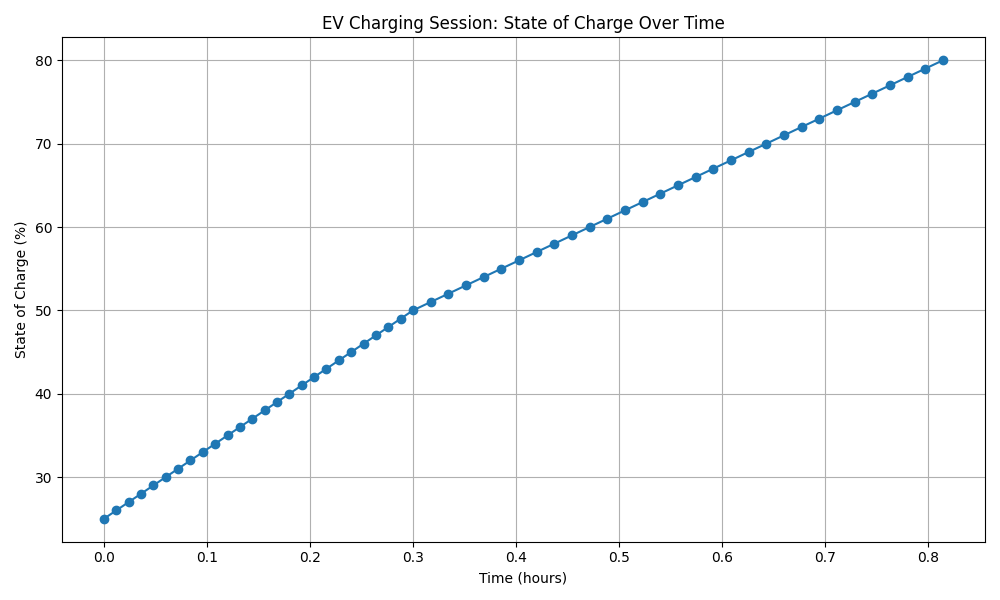

# EV Charging Session Simulator

Python-based EV charging simulation project by **Robert Solomon**.

This project simulates EV charging sessions using battery state of charge (SOC), charger power, and electricity cost inputs. It also models simplified SOC-based charging behaviour and generates visualizations of charging progress over time.

## Features
- Simulates charging from current SOC to target SOC
- Calculates energy added
- Estimates charging time
- Estimates charging cost
- Logs charging sessions to CSV
- Supports multiple predefined EV profiles
- Uses simplified SOC-based charging behaviour
- Generates a state-of-charge (SOC) graph for each charging session

## Project Structure
- `main.py` – entry point for the simulator
- `vehicle.py` – EV battery logic and predefined vehicle profiles
- `charger.py` – charger configuration
- `session.py` – charging session calculations and SOC-based charging simulation
- `utils.py` – CSV logging utilities
- `visualization.py` – graph generation for charging sessions
- `data/` – output logs and generated charts

## Example Scenario
- Vehicle: Tesla Model 3
- Battery Capacity: 60 kWh
- Starting SOC: 25%
- Target SOC: 80%
- Charger: 50 kW DC Fast Charger
- Price: €0.35 / kWh

## Supported EV Profiles
- Tesla Model 3 – 60.0 kWh
- Nissan Leaf – 40.0 kWh
- BMW i4 – 83.9 kWh

## Future Improvements
- Add charging curve logic
- Add multiple EV profiles
- Add Streamlit dashboard
- Add visual charts for SOC vs time

## Charging Behaviour

The simulator includes a simplified SOC-based charging model to better reflect real EV charging behaviour:

- 0%–50% SOC → 100% charger power
- 50%–80% SOC → 70% charger power
- 80%–100% SOC → 40% charger power

This models the idea that EV charging typically slows as the battery approaches a higher state of charge.

## Visualization

The simulator generates a graph showing battery state of charge (SOC) over time for each charging session.

Output example:
- `data/soc_over_time.png`

Snapshot:

## Related Work

This project is part of my broader interest in EV systems and charging infrastructure:

- [EV Charging Protocol Implementation (FYP)](https://github.com/robert-solomon12/FYP-Electric-Vehicle-Charging-Protocol-Implementation)  
  A final year project exploring communication between electric vehicles and charging stations, including Vehicle-to-Grid (V2G) concepts and protocol-level interactions.

  ## Future Improvements
- Add charging power vs time graph
- Add multiple charger types
- Add Streamlit dashboard (to further enhance visual analysis and interaction)
- Add cost comparison between different charging scenarios